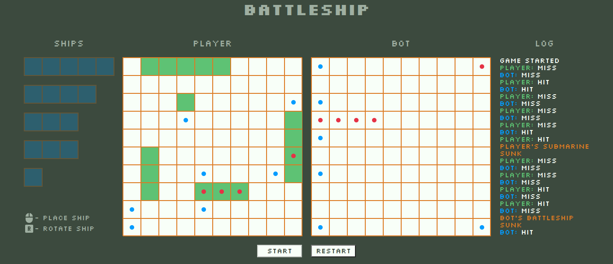

# BATTLESHIP

## Description

Welcome to Battleship, a classic game where you can battle against a computer opponent!

## Technologies used

- HTML
- CSS
- Typescript
- Vite
- Jest

## How to play

### Online

[GitHub pages link](https://kame-sama.github.io/battleship/)

### Locally

1.  Clone this repo to your local machine.
2.  Open the terminal and navigate to the project directory.
3.  Run `npm install` to install dependencies.
4.  Run `npm run dev` to start the development server.
5.  Go to your localhost server to play the game.

## Features

- Drag and drop functionality for placing ships.
- Rotation of ships using the "r" key.
- Feedback for successful hits and misses.

## Acknowledgement

- Inspired by [The Odin Project](https://www.theodinproject.com/lessons/node-path-javascript-battleship).
- Favicon crated by [Freepik - Flaticon](https://www.flaticon.com/free-icons/ship).
- This project was created for educational purposes and as a fun way to explore web development technologies.
- Special thanks to the creators of Battleship.
